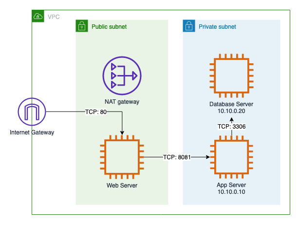

# Deploy with Terraform

This document outlines the steps required to deploy the web app using terraform.

## Prerequisites
1. AWS account CLI credentials
2. [Terraform](https://learn.hashicorp.com/tutorials/terraform/install-cli) 
3. Access to the respective AMIs (not public)
    * Web instance (`ami-0d38e3348f242b184`, WebServer - v2 (React Nginx)) 
    * App instance (`ami-04fa1e528a9c7bf67`, AppServer - v3 (Node))
    * DB instance (`ami-01a02370342aded44`, DatabaseServer - v3 (MySQL))

## Steps to launch the web app

1. Configure AWS credentials by running the following command and entering your `AWS Access Key ID` and `AWS Secret Access Key`.
```
aws configure
```
2. Run the Terraform script
```
cd terraform/
terraform plan
terraform apply
```
3. Once the resources are provisioned, visit the HTTP address of the web server public dns (Output from Terraform).

## Architecture


## Extra info

### Fixed private IP addresses
In order to ensure that the Web Server can communicate with the App Server, and likewise for the App Server and Database Server, private IPs are set to be 
* `10.10.0.10` for App Server
* `10.10.0.20` for Database Server

This allows for the private IPs to be hardcoded in Nginx's proxy and Node's MySQL connection, so that once the instances launch the web app will be ready.

### PM2
PM2 is configured to start the backend service once the App instance launches.

Reference: https://pm2.keymetrics.io/docs/usage/startup/